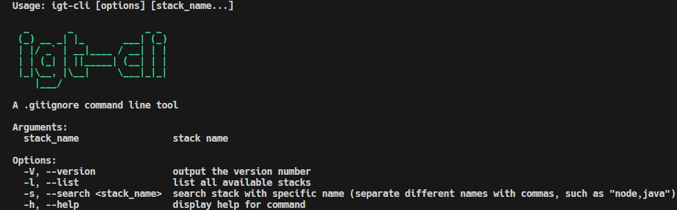

# igt-cli

A .gitignore command line tool

Uses [gitignore.io](https://www.toptal.com/developers/gitignore/)

## Installation

```
$ npm install -g igt-cli
```

## Usage



To create Node.js and Java .gitignore file

```
$ igt-cli node java >> .gitignore
```
